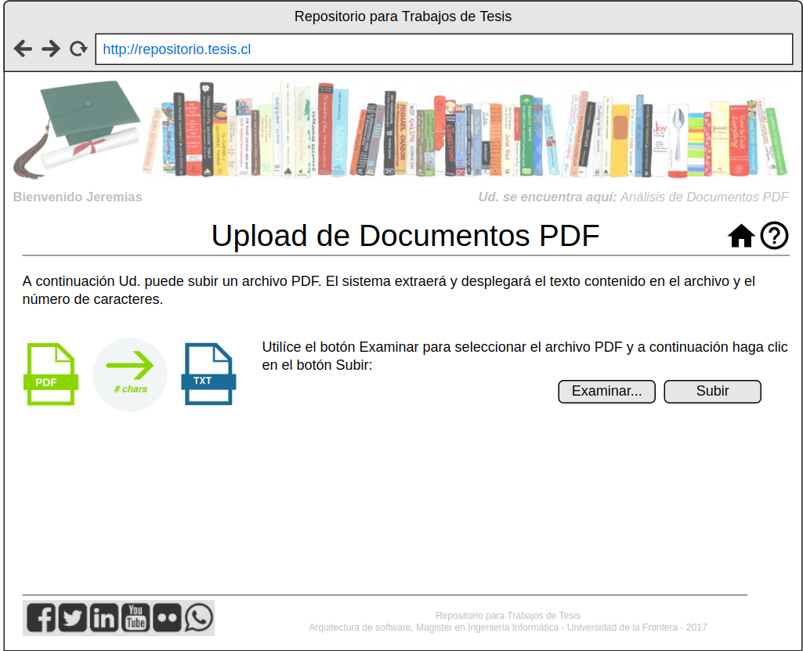

========
Mockups
========

Mediante la siguiente interfaz es posible iniciar el proceso de extracción del contenido de texto desde un archivo PDF:

El sistema despliega un cuadro de diálogo de selección de archivo PDF cuando el usuario hace clic en el botón Examinar:

Una vez que el archivo seleccionado es subido y el usuario hace clic en el botón Subir, el sistema despliega la siguiente interfaz, donde se despliega el conteo de caracteres de texto encontrados en el PDF y el contenido correspondiente en formato texto plano:

**Para repetir el proceso y volver al subir un nuevo archivo PDF, el usuario puede hacer clic en el botón Volver y el sistema desplegará la interfaz inicial.**