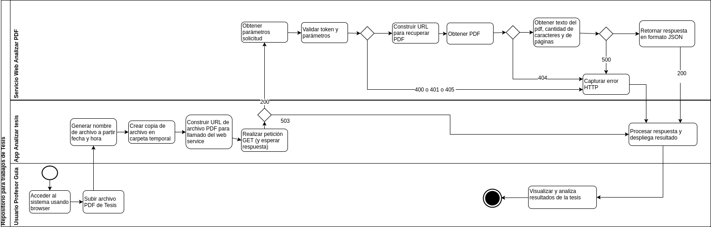
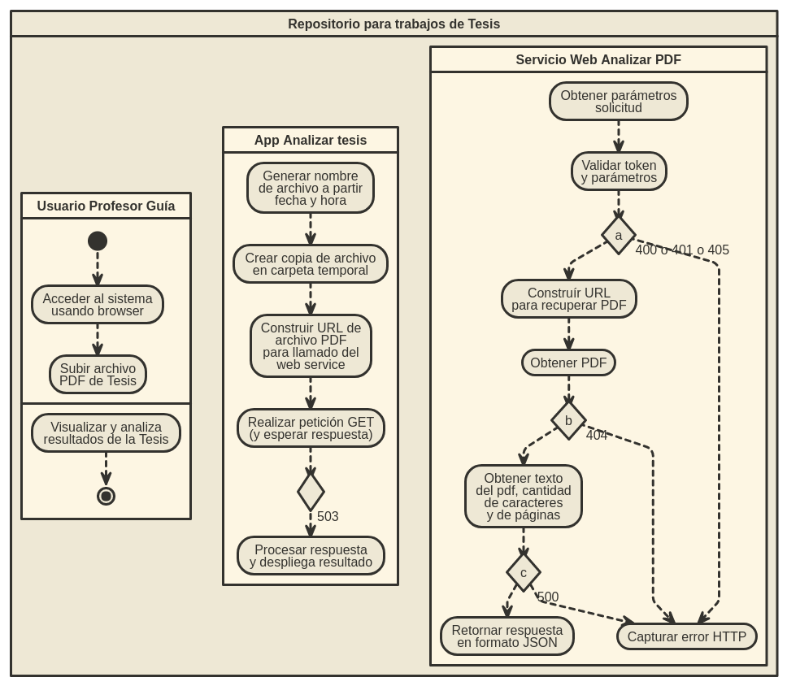

===============================================================
Diseño -  Modelo 4+1 - Documento 1 (Software Architecture Document)
===============================================================

El método 4+1 nos permitirá describir la arquitectura de sistemas software llamado Repositorio para Trabajos de Tesis, basados en el uso de múltiples vistas concurrentes.
Estas vistas nos permitirán analizar el problema y describir el sistema desde el punto de vista de distintos interesados, como lo son los usuarios finales (Usuario profesor guía y Usuario estudiante tesista), los desarrolladores y/o jefes de proyecto.

Las cuatro vistas del modelo son:

#. Vista lógica.
#. Vista de desarrollo. 
#. Vista de proceso. 
#. Vista física. 
#. Además, una selección de casos de uso o que se utilizará para ilustrar la arquitectura sirviendo como una vista más. 

**Dichas vistas se mencionan a continuación:**

*1. Vista lógica*
^^^^^^^^^^^^^^

Está enfocada en describir la estructura y funcionalidad del sistema, y para éste sistema se utilizó un diagrama de Clases para representar esta Vista. El cual está separado en 2 package:

#. Package AppAnalizarTesis: 

* Clases 1: Index
* Clase 2: ProcesarTesisPdf

#. Package WS-AnalizarPDF (Servicio Web):

* Clase 1: AnalizarPdf
* Clase 2: Parser

La siguiente imágen fue creada con la herramienta **draw.io**

.. image:: image/d_clases.png

La siguiente imágen fue creada mediante código con la herramienta **codetouml** http://londres.ceisufro.cl/codetouml

.. image:: codetouml/diagrama_clases.png

*2. Vista de desarrollo*
^^^^^^^^^^^^^^^^^^^^^

Ilustra el sistema de la perspectiva del programador y está enfocado en la administración de los artefactos de software.
El Diagrama Componentes UML se utiliza para describir los componentes del sistema.
El cual contiene dos componentes

#. Componente 1: App Analizar Tesis
#. Componente 2: Servicio Web Analizar PDF

**Ambos conectados mediante el protocolo HTTP.**

La siguiente imágen fue creada con la herramienta **draw.io**

.. image:: image/d_componentes.png

No fue posible generar este diagrama con **codetouml** ya que no se encontró en la herramienta los componentes y conectores requerido para esta representación.

*3. Vista de proceso*
^^^^^^^^^^^^^^^^^

Explica los procesos de sistema y cómo se comunican. se enfoca en el comportamiento del sistema en tiempo de ejecución

Esta vista se representará con un diagrama de Actividad.

En él se detallan tres actores:

#. Usuario
#. App
#. Servidor Web

La siguiente imágen fue creada con la herramienta **draw.io**

La siguiente imágen fue creada mediante código con la herramienta **codetouml** http://londres.ceisufro.cl/codetouml. 
El diagrama se encuentra incompleto ya que no se logró asociar correctamente las actividades de los distintos roles.

*4. Vista fisica*
^^^^^^^^^^^^^^

Describe el sistema desde el punto de vista de un ingeniero de sistemas. Está relacionada con la topología de componentes de software en la capa física (hardware), así como las conexiones físicas entre estos componentes.

En el se muestra dos nodos, como capa física y dentro de ellos sus artefactos o componentes de software:

1. Nodo 1: Workstation

* Componente Browser.

2. Nodo 2: Servidor Web

* Servicio web Analizar PDF
* Parser (Librería PHP que permite leer un archivo PDF)

La siguiente imágen fue creada con la herramienta **draw.io**

.. image:: image/d_despliegue.png

No fue posible generar este diagrama con **codetouml** ya que no se encontró en la herramienta los componentes y conectores requerido para esta representación.

*5. Escenarios*
^^^^^^^^^^^^

Los escenarios describen secuencias de interacciones entre objetos, y entre procesos. Se utilizan para identificar y validar el diseño de arquitectura. También sirven como punto de partida para pruebas de un prototipo de arquitectura.
La descripción de la arquitectura se ilustra utilizando un conjunto de casos de uso.

En el, se modelan tres casos de uso y dos actores del sistema.

1. Actores:

* Profesor Guía

2. Casos de uso:

* Mostrar formulario upload tesis.
* Subir Archivo PDF.
* Mostrar resultado análisis tesis pdf.

La siguiente imágen fue creada con la herramienta **draw.io**

.. image:: image/d_casos_uso.png

La siguiente imágen fue creada mediante código con la herramienta **codetouml** http://londres.ceisufro.cl/codetouml. 
El diagrama se encuentra incompleto ya que no se logró asociar correctamente el actor Profesor Guía con el caso de uso "Mostrar formulario upload tesis".

