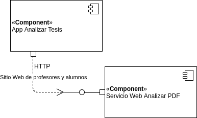

===============================================================
Diseño -  Modelo 4+1 - Documento 2 (Software Design Guidelines)
===============================================================

:Repositorio para Análisis de Archivos PDF de Tesis Software Design Guidelines:
^^^^^^^^^^^^^^^^^^^^^^^^^^^^^^^^^^^^^^^^^^^^^^^^^^^^^^^^^^^^^^^^^^^^^^^^^^^^^^^^^

**Change History**

Versión 1.0, Versión inicial completa, jmora, cnavarro, Diciembre de 2017.

#. **Scope**

Este documento muestra los principales elementos que componen la arquitectura del sistema Repositorio para Análisis de Archivos PDF de Tesis. La arquitectura propuesta, es una versión parcial de todo el sistema acotada exclusivamente a los componentes que que abordan las historias de usuario seleccionadas.

#. **References**

Este documento se encuentra estructurado de acuerdo a las recomendaciones provistas en:

[1] Kruchten, P. (1995). Architectural blueprints—The “4+ 1” view model of software architecture. Tutorial Proceedings of Tri-Ada, 95, 540-555.

[2] http://www.soa-manifesto.org/default_spanish.html, consultado el 18 de diciembre de 2017.

#. **Software Architecture**

Para el diseño del sistema se ha definido la utilizar una arquitectura orientada a servicios (SOA). 

#. **Architectural Goals & Constraints**

La razón para utilizar SOA se fundamenta en la necesidad de independizar los componentes del sistema, para separar aspectos que pueden variar a velocidades diferentes. Por ejemplo, un proceso relevante que efectúa el sistema es el análisis de archivos pdf, cuyos estándares pueden variar en una línea totalmente independiente del modo como podrían cambiar las necesidades de eventuales cambios en la interfaz de usuario del sistema, por tanto se estima conveniente separar estos aspectos.
Una desventaja relevante de utilizar SOA está asociada a los tiempos de respuesta dependientes de la velocidad con que logren interoperar los componentes a implementar, se deberá poner atención en los volúmenes de datos a intercambiar en términos de parámetros y resultados en la interacción con los servicios.

#. **Logical Architecture**

Las historias de usuario seleccionadas están enfocadas en el proceso de upload y análisis de archivos PDF. El modelo lógico refleja por tanto los elementos del sistema que permiten al usuario especificar el archivo pdf a subir y analizar el archivo pdf, mediante las clases Index() y  ProcesadorTesisPdf() respectivamente, las cuales acceden al servicio web implementado en la clase AnalizadorPdf().

El uso de estas clases, permite la implementación encapsulada en sus atributos y métodos de las características y comportamientos específicos requeridos, como el despliegue de la página de subida, el despliegue de resultados y el análisis de los archivos pdf.

El propósito de la clase index es implementar la interfaz de usuario que permite efectuar el upload de archivo mediante un formulario html. El proceso de autentificación del usuario del sistema no es crítico para esta parte del sistema cuya arquitectura se desea describir y por tanto no está reflejado en las vistas, sin embargo, se asume que será posible acceder a los atributos del usuario autentificado (por ejemplo mediante clase hipotética). La clase contempla además un atributo adicional para especificar dónde será enviado el archivo seleccionado por el usuario.

La clase ProcesadorTesisPdf() se encarga de recibir el archivo pdf enviado para análisis y dejarlo disponible en una URL visible para el Web Service. El método principal para desplegar_resultados() invocará al web service de análisis de archivos pdf y desplegará los resultados de contenido en formato txt, conteo de caracteres y página, para el usuario.

La clase AnalizadorPdf() implementa el servicio web que será utilizado por la aplicación. Los parámetros de entrada encapsulan la autentificación y la ubicación (enlace http) al archivo pdf que debe ser analizado. Mediante el método obtener_atributos_pdf(), se obtiene el pdf remoto, se almacena en un archivo temporal y luego se analiza. Para el análisis se utiliza la clase Parser() que implementa métodos de análisis de archivos pdf, como por ejemplo, la extracción del contenido en formato texto (getText), el conteo de páginas y caracteres (getDetails).

#. **Process Architecture**

Los componentes aplicación (App) y Servicio Web (Ws) interactúan para permitir al usuario completar el proceso de subida de archivos pdf y revisión del texto y número de caracteres.
El proceso se inicia cuando el usuario sube un archivo pdf. La App almacena el archivo en una ubicación que queda visible en internet para el Ws, luego prepara la solicitud para el Ws especificando en la solicitud la ubicación del archivo en internet (en la solicitud se envía parámetros que abrevian la URL real del archivo pdf que debe ser analizado, además de un token que controla el acceso autorizado). Una vez construida la solicitud es enviada por la App al Ws, el cual reconstruye la URL del archivo pdf, lo descarga desde internet, lo analiza y si todo sale bien devuelve el resultado empaquetado en formato JSON.
Es posible que muchas App consuman el Ws, por tanto deberá disponerse la infraestructura necesaria para soportar la concurrencia requerida. El prototipo implementado utiliza un archivo temporal para almacenar y analizar el pdf y se tuvo la precaución de utilizar nombres de archivos temporales únicos para evitar colisiones.
Debe considerarse asignar los recursos de procesamiento necesarios para que el Ws efectúe el análisis del pdf en un tiempo apropiado, que debe estar evidentemente por debajo del timeout de la conexión http y considerar el tiempo de espera aceptable para el usuario objetivo y la concurrencia esperada. Debe establecerse y configurarse límites apropiados también para el tamaño del archivo pdf, debido a que se detectó mediante pruebas preliminares que esta variable impacta directamente en los tiempos requeridos para el procesamiento.
El proceso puede verse interrumpido por diversos eventos asociados a la naturaleza de los servicios Web, por tanto estos eventos deben ser adecuadamente capturados, codificados e informados por la App. El prototipo implementa por ejemplo los siguientes códigos de mensajes de error http:

* 503 'Service Unavailable'
* 405 'Method Not Allowed'
* 400 'Bad Request'
* 401 'Bad Request'
* 404 'Not Found'
* 500 'Internal Server Error'

#. **Development Architecture**
El sistema está basado en dos componentes que interactúan a través de una jerarquía donde la aplicación consume los servicios del web service para entregar al usuario los resultados de análisis requeridos respecto a un pdf. 

El componente asociado a la aplicación implementa aquellos relacionado con la interfaz de usuario y el control de las solicitudes y resultados efectuadas al Web service (todos asociados al dominio específico de necesidades de revisión de trabajos de tesis). Es posible identificar paquetes de trabajo para la etapa de codificación, donde se deberá abordar la construcción elementos interfaz de usuario, comunicaciones con web service y análisis de archivos pdf.
El componente correspondiente al servicio web no está asociado a dominio específico, sino al propósito genérico de analizar archivos pdf, razón por la cual el componente es reutilizable y a la vez abre posibilidades de incorporar componentes desarrollados por terceros. Una ventaja muy relevante de utilizar servicios web, consisten en la independencia de la tecnología a utilizar para su implementación, sin embargo se debe tener en cuenta las posibilidades de infraestructura disponibles y los perfiles disponibles a su vez en el equipo de desarrollo. Los aspectos de seguridad son relevantes toda vez que los datos intercambiados con el servicio web pueden quedar expuestos en un canal no seguro, por lo cual se recomienda el uso de https en producción, además de los mecanismos de autentificación usuales. Deberá considerarse paquetes de trabajo asociados a aspectos de seguridad, en particular la configuración y verificación de https y autenticación.

#. **Physical Architecture**
La implementación de los componentes debe efectuarse para operar en máquinas o servidores diferentes. La aplicación podrá operar en un servidor A y el servicio web podrá operar en un servidor B. La comunicación podrá efectuarse a través de internet pero bajo estándares mínimos de protocolo seguro como https. En concreto ambos componentes quedan separados físicamente (aunque la “separación física” puede referirse también a máquinas virtuales distintas). 

.. image:: image/d_despliegue.png

Este mapeo otorga flexibilidad e implica mínimo impacto en el código fuente. Es altamente recomendable utilizar infraestructura en la nube, de modo que los aspectos de disponibilidad, confiabilidad, rendimiento y escalabilidad, sean manejables en función de los recursos asignados.

#. **Scenarios**
Las cuatro vistas lógica, desarrollo, proceso y física convergen en la vista de escenario mediante un diagrama de caso de uso, que destaca los comportamientos relevantes del sistema que a su vez presentan resultados observables como el despliegue del formulario de upload por parte de la aplicación, que permite gatillar el proceso de subida de archivos pdf, el cual a su vez mediante el consumo del servicio web de análisis de archivos pdf, permite entregar los resultados de análisis de la tesis reportada por el usuario.

.. image:: image/d_casos_uso.png
